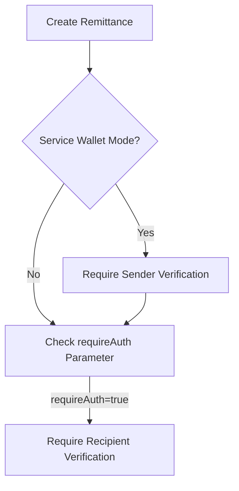

# Email Remittance Pro

A platform for sending remittances via email with escrow functionality and blockchain settlement.

## Key Features
- 7-day claim window for remittances
- 1.5% storage fee on expired remittances
- Zero platform gas fees - users pay their own gas
- Recipient wallet generation with import instructions
- Business verification workflow
- Gift card redemption flow

## 🔐 Configurable Identity Verification

Email Remittance Pro provides **flexible identity verification** through Self Protocol, allowing businesses to configure compliance requirements based on their specific needs.

### **Verification Configuration Options**

| Feature | Configurability | Default Setting | Environment Variable |
|---------|------------------|------------------|----------------------|
| **Self Protocol Integration** | Enable/disable | Disabled | `SELF_STAGING=true/false` |
| **Sender Verification** | Required/optional | Required (service wallet) | `DEFAULT_REQUIRE_SENDER_AUTH=true` |
| **Recipient Verification** | Required/optional | Optional | `DEFAULT_REQUIRE_AUTH=false` |
| **Verification Scope** | Sender/recipient/both/none | Sender only | Per-transaction parameter |

### **How Verification Works**

1. **Sender Verification** (Service Wallet Mode):
   - Required for platform-fronted transactions
   - Verifies name, date of birth, nationality, and OFAC status
   - Cached per session (only required once per 30 minutes)
   - Configurable via `requireSenderAuth` parameter

2. **Recipient Verification** (Optional):
   - Businesses can require verification for specific transactions
   - Verifies minimum age (18+) and OFAC status
   - Configured via `requireAuth` parameter when creating remittance
   - Example: `requireAuth: true` for high-value transactions

### **Configuration Examples**

**1. Enable Self Protocol (Testing Mode)**
```env
# .env configuration
SELF_STAGING=true       # Mock passports OK (testing)
DEFAULT_REQUIRE_AUTH=false  # Recipient verification optional
```

**2. Production Configuration**
```env
# .env configuration
SELF_STAGING=false      # Real passports only (production)
DEFAULT_REQUIRE_AUTH=true   # Require recipient verification
```

**3. Per-Transaction Configuration**
```typescript
// API Request Example
{
  senderEmail: "business@company.com",
  recipientEmail: "customer@gmail.com",
  amount: 500,
  chain: "celo",
  requireAuth: true,  // Business requires recipient verification
  requireSenderAuth: true  // Require sender verification
}
```

### **Business Compliance Strategies**

Businesses can implement different verification strategies:

1. **Basic Compliance** (Default):
   - Sender verification for service wallet transactions
   - No recipient verification
   - Suitable for low-value remittances

2. **Enhanced Compliance** (Recommended):
   - Sender verification for all transactions
   - Recipient verification for transactions > $100
   - OFAC screening for all parties
   - Suitable for regulated markets

3. **Full Compliance** (Enterprise):
   - Sender verification for all transactions
   - Recipient verification for all transactions
   - Country-specific verification requirements
   - Detailed audit logging
   - Suitable for financial institutions

### **Verification Flow**



## Testing

### Running Tests
```bash
# Run all tests
npm test

# Run tests with coverage
npm test -- --coverage

# Run specific test file
npx jest tests/integration/feeStructure.test.ts
```

### Test Coverage Requirements
- Minimum 93% coverage for statements, branches, functions, and lines
- Comprehensive tests for all core functionality:
  - Remittance creation and claiming
  - Fee calculations (1.5% protocol and storage fees)
  - Expiration handling (7-day window)
  - Wallet generation with import instructions
  - Business verification workflow
  - Gift card redemption flow

## Deployment

### Backend Deployment (Render)
1. **Connect your GitHub repository** to Render
2. **Set environment variables** in Render dashboard:
   - `WALLET_PRIVATE_KEY`
   - `RESEND_API_KEY`
   - `BASE_URL`
   - `DATABASE_URL`
   - `CRON_API_KEY`
3. **Configure build command**: `npm install && npm run build`
4. **Configure start command**: `npm start`

### Frontend Deployment (Cloudflare Pages)
1. **Connect your GitHub repository** to Cloudflare Pages
2. **Set build command**: `cd frontend && npm install && npm run build`
3. **Set output directory**: `frontend/dist`
4. **Configure environment variables** if needed

### Cron Job Setup
To properly track and enforce remittance expirations, set up a cron job in Render:

1. Go to your Render service dashboard
2. Navigate to "Cron Jobs" section
3. Create a new cron job with:
   - **Schedule**: `0 * * * *` (hourly)
   - **Command**: `curl -X POST -H "Authorization: Bearer $CRON_API_KEY" https://yourdomain.com/api/process-expired`
   - **HTTP Method**: POST

For production environments, we recommend:
1. **Authentication**: Use API keys to secure the endpoint
2. **Logging**: Ensure all cron job executions are logged
3. **Monitoring**: Set up alerts for failed cron jobs
4. **Idempotency**: Ensure the endpoint can be safely retried
    D -->|requireAuth=false| F[No Verification Required]
    E --> G[Claim Remittance]
    F --> G
```

### **Implementation Notes**

1. **Verification is optional** - Businesses decide when to require it
2. **No PII stored** - Only verification results are stored (pass/fail, age, sanctions status)
3. **Configurable per transaction** - Each remittance can have different requirements
4. **Fallback mechanisms** - If Self Protocol is unavailable, businesses can implement alternative verification methods
5. **Regulatory compliance** - Meets AML/KYC requirements without storing sensitive data